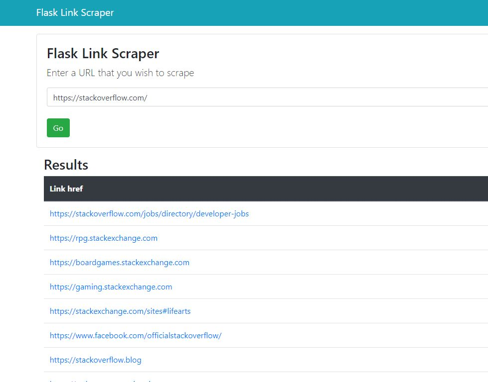

# Flask Link Scraper

A basic Python Flask app that scrapes all links from a provided URL, displays them as hyperlinks and writes them to a csv file.

Uses the [requests_HTML library][1].

[1]: https://pypi.org/project/requests-html/
